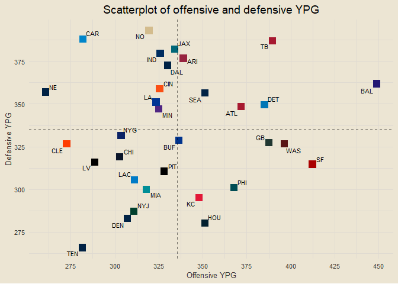
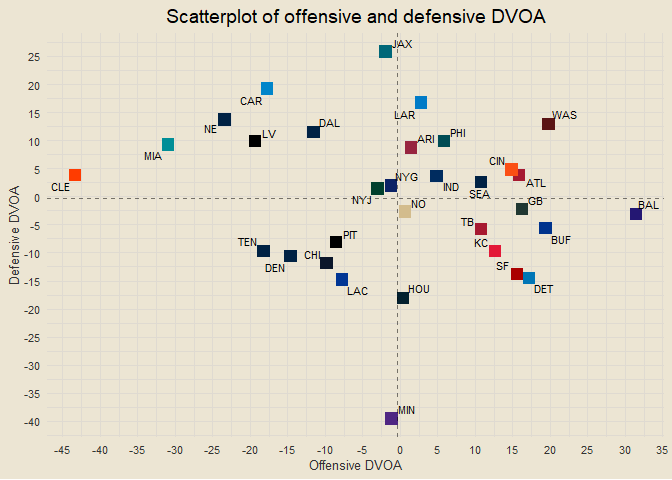
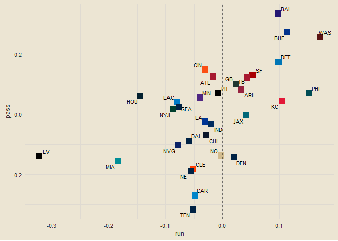
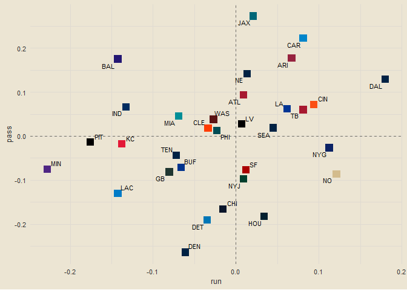
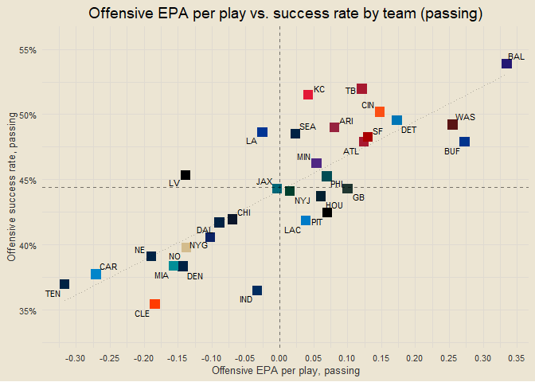
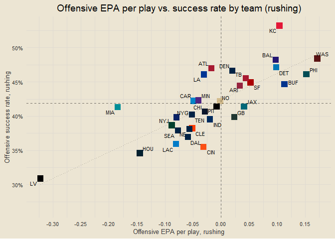
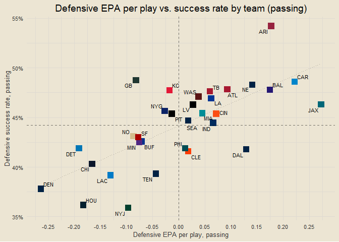
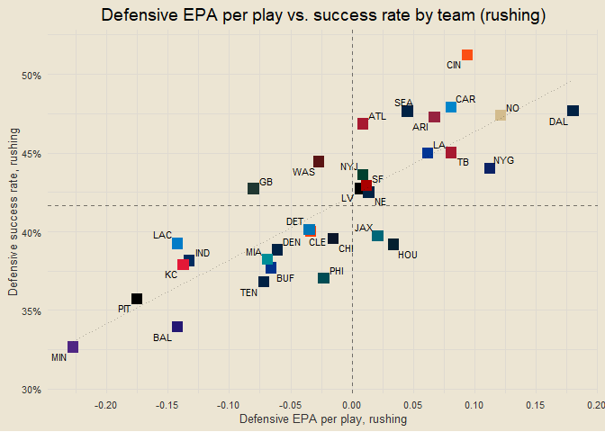

### Contents

- [Offensive and Defensive PPG](#offensive-and-defensive-ppg)
- [Offensive and Defensive YPG](#offensive-and-defensive-ypg)
- [Offensive and Defensive EPA](#offensive-and-defensive-epa)

------------------------------------------------------------------------

### Offensive and Defensive PPG

<!-- -->

------------------------------------------------------------------------

### Offensive and Defensive YPG

<!-- -->

------------------------------------------------------------------------

### Offensive and Defensive EPA

<!-- -->

------------------------------------------------------------------------

### Offense and Defense EPA Comparisons

    ## [1] "LA vs. MIN: Bad Offense, Bad Defense vs. Good Offense, Good Defense"
    ## [1] "CIN vs. PHI: Good Offense, Bad Defense vs. Good Offense, Good Defense"
    ## [1] "CLE vs. BAL: Bad Offense, Good Defense vs. Good Offense, Bad Defense"
    ## [1] "DET vs. TEN: Good Offense, Good Defense vs. Bad Offense, Good Defense"
    ## [1] "HOU vs. IND: Good Offense, Good Defense vs. Bad Offense, Good Defense"
    ## [1] "JAX vs. GB: Good Offense, Bad Defense vs. Good Offense, Good Defense"
    ## [1] "MIA vs. ARI: Bad Offense, Good Defense vs. Good Offense, Bad Defense"
    ## [1] "NE vs. NYJ: Bad Offense, Bad Defense vs. Bad Offense, Good Defense"
    ## [1] "TB vs. ATL: Good Offense, Bad Defense vs. Good Offense, Bad Defense"
    ## [1] "LAC vs. NO: Bad Offense, Good Defense vs. Bad Offense, Good Defense"
    ## [1] "SEA vs. BUF: Good Offense, Good Defense vs. Good Offense, Good Defense"
    ## [1] "DEN vs. CAR: Bad Offense, Good Defense vs. Bad Offense, Bad Defense"
    ## [1] "LV vs. KC: Bad Offense, Good Defense vs. Good Offense, Good Defense"
    ## [1] "WAS vs. CHI: Good Offense, Bad Defense vs. Bad Offense, Good Defense"
    ## [1] "SF vs. DAL: Good Offense, Good Defense vs. Bad Offense, Bad Defense"
    ## [1] "PIT vs. NYG: Good Offense, Good Defense vs. Bad Offense, Bad Defense"

------------------------------------------------------------------------

### DVOA

<!-- -->

------------------------------------------------------------------------

------------------------------------------------------------------------

### NPR Standings

<!-- -->

------------------------------------------------------------------------

### Scatterplot of NPR

<!-- -->

------------------------------------------------------------------------

### Week Predictions

    ## [1] "KC def. LV (99.1%)"
    ## [1] "ARI def. MIA (98.4%)"
    ## [1] "BAL def. CLE (98.2%)"
    ## [1] "NYJ def. NE (96.7%)"
    ## [1] "DEN def. CAR (96.7%)"
    ## [1] "MIN def. LA (95.3%)"
    ## [1] "DET def. TEN (93.5%)"
    ## [1] "WAS def. CHI (93%)"
    ## [1] "GB def. JAX (89.2%)"
    ## [1] "PIT def. NYG (84.5%)"
    ## [1] "SF def. DAL (76.9%)"
    ## [1] "LAC def. NO (74.8%)"
    ## [1] "TB def. ATL (74.2%)"
    ## [1] "PHI def. CIN (57.3%)"
    ## [1] "HOU def. IND (54.5%)"
    ## [1] "BUF def. SEA (53.2%)"

``` r
season_pbp |>
  filter(play_type == "pass") |>
  group_by(passer, week) |>
  summarise(n = n(),
            avg_epa = mean(epa, na.rm = T),
            .groups = "drop") |>
  filter(week == max(end_games$week) & n >= 5) |>
  arrange(desc(avg_epa)) |>
  mutate(avg_epa = round(avg_epa, 3),
         passer = as.character(glue::glue("{passer} ({round(avg_epa, 2)})"))) |>
  ggplot(aes(reorder(passer, avg_epa), avg_epa)) +
  geom_col(aes(fill = avg_epa), show.legend = F) +
  coord_flip() +
  scale_fill_gradient(low = "indianred3", high = "springgreen4") +
  labs(x = NULL, y = "Avg. EPA",
       title = "Avg. EPA by QBs this past week") +
  scale_y_continuous(breaks = seq(-1, 1, by = 0.1))
```

<!-- -->

``` r
team_pass_run_share = season_pbp |>
  filter(play_type %in% c("pass", "run")) |>
  group_by(team = posteam) |>
  count(play_type) |>
  mutate(pct = round(n / sum(n), 3)) |>
  ungroup()

run_heavy = team_pass_run_share |>
  filter(play_type == "run") |>
  arrange(desc(pct)) |>
  pull(team)

team_pass_run_share |>
  mutate(team = factor(team, levels = rev(run_heavy)),
         play_type = ifelse(play_type == "pass", "Pass", "Run")) |>
  ggplot(aes(team, pct)) +
  geom_col(aes(fill = play_type)) +
  coord_flip() +
  labs(x = NULL, y = "Rushing Share", fill = NULL,
       title = "Run the damn ball!") +
  scale_fill_manual(values = c("lightsteelblue3", "springgreen4")) +
  theme(legend.position = "right") +
  scale_y_continuous(breaks = seq(0, 1, by = 0.1), labels = scales::percent)
```

<!-- -->

``` r
team_run_shares_vec = team_pass_run_share |>
  filter(play_type == "run") |>
  arrange(team) |>
  pull(pct)

team_off_ypg_vec = team_ypg |>
  arrange(team) |>
  pull(off_ypg)

cor_coef = round(cor(team_run_shares_vec, team_off_ypg_vec), 3)

team_pass_run_share |>
  filter(play_type == "run") |>
  select(team, run_pct = pct) |>
  inner_join(team_ypg |>
  select(team, off_ypg), by = "team") |>
  ggplot(aes(run_pct, off_ypg)) +
  geom_point(aes(col = team), size = 4, shape = "square", show.legend = F) +
  geom_line(stat = "smooth", formula = y ~ x, method = "lm", linetype = "dashed", alpha = 0.5) +
  ggrepel::geom_text_repel(aes(label = team), size = 3) +
  scale_color_manual(values = team_hex) +
  labs(x = "Rushing share", y = "Offensive YPG",
       title = "Does running the damn ball work?",
       subtitle = glue("Correlation: {cor_coef}")) +
  scale_x_continuous(breaks = seq(0, 1, by = 0.05), labels = scales::percent) +
  scale_y_continuous(breaks = seq(200, 500, by = 25))
```

<!-- -->

``` r
season_pbp |>
  filter(play_type %in% c("pass", "run")) |>
  group_by(team = posteam, play_type) |>
  summarise(epa = mean(epa, na.rm = T),
            .groups = "drop") |>
  pivot_wider(id_cols = team, names_from = "play_type", values_from = "epa") |>
  ggplot(aes(run, pass)) +
  geom_point(aes(col = team), size = 4, shape = "square", show.legend = F) +
  scale_color_manual(values = team_hex) +
  ggrepel::geom_text_repel(aes(label = team), size = 3, max.overlaps = 32) +
  geom_vline(xintercept = 0, linetype = "dashed", alpha = 0.5) +
  geom_hline(yintercept = 0, linetype = "dashed", alpha = 0.5)
```

<!-- -->

``` r
season_pbp |>
  filter(play_type %in% c("pass", "run")) |>
  group_by(team = defteam, play_type) |>
  summarise(epa = mean(epa, na.rm = T),
            .groups = "drop") |>
  pivot_wider(id_cols = team, names_from = "play_type", values_from = "epa") |>
  ggplot(aes(run, pass)) +
  geom_point(aes(col = team), size = 4, shape = "square", show.legend = F) +
  scale_color_manual(values = team_hex) +
  ggrepel::geom_text_repel(aes(label = team), size = 3, max.overlaps = 32) +
  geom_vline(xintercept = 0, linetype = "dashed", alpha = 0.5) +
  geom_hline(yintercept = 0, linetype = "dashed", alpha = 0.5)
```

<!-- -->

``` r
season_pbp |>
  filter(play_type %in% c("pass", "run")) |>
  group_by(team = posteam) |>
  summarise(off_epa = mean(epa, na.rm = T)) |>
  inner_join(season_pbp |>
  filter(play_type %in% c("pass", "run")) |>
  group_by(team = defteam) |>
  summarise(def_epa = mean(epa, na.rm = T)), by = "team") |>
  mutate(ovr_epa = off_epa + def_epa) |>
  arrange(desc(ovr_epa))
```

    ## # A tibble: 32 × 4
    ##    team   off_epa  def_epa ovr_epa
    ##    <chr>    <dbl>    <dbl>   <dbl>
    ##  1 BAL    0.230    0.0598   0.289 
    ##  2 WAS    0.237    0.0283   0.265 
    ##  3 JAX    0.00835  0.179    0.188 
    ##  4 CIN    0.0919   0.0501   0.142 
    ##  5 ARI    0.0243   0.115    0.139 
    ##  6 TB     0.0912   0.0428   0.134 
    ##  7 BUF    0.177   -0.0544   0.122 
    ##  8 ATL    0.0389   0.0487   0.0876
    ##  9 PHI    0.0784  -0.00173  0.0767
    ## 10 DAL   -0.0877   0.139    0.0508
    ## # ℹ 22 more rows

``` r
season_pbp |>
  filter(week >= 4) |>
  filter(play_type == "pass") |>
  group_by(passer) |>
  summarise(n = n(),
            epa_per_db = mean(epa, na.rm = T)) |>
  mutate(n_pct = percent_rank(n)) |>
  filter(n_pct >= 0.5) |>
  ggplot(aes(n, epa_per_db)) +
  geom_point() +
  ggrepel::geom_text_repel(aes(label = passer), size = 3, max.overlaps = 50) +
  labs(x = "Number of dropbacks",
       y = "EPA per dropback",
       title = "EPA per dropback",
       subtitle = "Weeks 4-6 / Only QBs in 50th percentile of higher in dropbacks") +
  scale_x_continuous(breaks = seq(0, 1000, by = 10)) +
  scale_y_continuous(breaks = seq(-1, 1, by = 0.1))
```

<!-- -->

``` r
season_pbp |>
  filter(play_type == "pass" & week >= 4) |>
  group_by(passer) |>
  summarise(n = n(),
            success_rate = round(mean(success, na.rm = T), 3)) |>
  mutate(n_pct = percent_rank(n)) |>
  filter(n_pct >= 0.5) |>
  arrange(desc(success_rate))
```

    ## # A tibble: 30 × 4
    ##    passer         n success_rate n_pct
    ##    <chr>      <int>        <dbl> <dbl>
    ##  1 L.Jackson    114        0.596 0.729
    ##  2 J.Goff        77        0.571 0.508
    ##  3 P.Mahomes    102        0.529 0.661
    ##  4 C.Williams    89        0.528 0.593
    ##  5 B.Mayfield   162        0.525 0.949
    ##  6 J.Burrow     133        0.504 0.881
    ##  7 T.Lawrence   128        0.5   0.864
    ##  8 M.Stafford   105        0.495 0.678
    ##  9 J.Daniels     99        0.475 0.644
    ## 10 G.Smith      188        0.468 1    
    ## # ℹ 20 more rows

``` r
team_logos = teams_colors_logos |>
  filter(team_abbr %in% all_teams) |>
  select(team_abbr, team_logo_espn)

# team success rate by down (passing and running plays)
pass_epa_success = season_pbp |>
  filter(play_type == "pass") |>
  group_by(posteam, play_type) |>
  summarise(avg_epa = mean(epa),
            success_rate = mean(success),
            .groups = "drop")

opesp = pass_epa_success |>
  ggplot(aes(avg_epa, success_rate)) +
  geom_point(aes(col = posteam), shape = "square", size = 4, show.legend = F) +
  ggrepel::geom_text_repel(aes(label = posteam), size = 3, max.overlaps = 32) +
  scale_color_manual(values = team_hex) +
  geom_line(stat = "smooth", method = "lm", formula = y ~ x, linetype = "dotted", alpha = 0.25) +
  geom_vline(xintercept = 0, linetype = "dashed", alpha = 0.5) +
  geom_hline(yintercept = mean(pass_epa_success$success_rate), linetype = "dashed", alpha = 0.5) +
  labs(x = "Offensive EPA per play, passing",
       y = "Offensive success rate, passing",
       title = "Offensive EPA per play vs. success rate by team (passing)") +
  scale_x_continuous(breaks = seq(-0.5, 0.5, by = 0.05)) +
  scale_y_continuous(breaks = seq(0, 1, by = 0.05), labels = scales::percent)

rush_epa_success = season_pbp |>
  filter(play_type == "run") |>
  group_by(posteam, play_type) |>
  summarise(avg_epa = mean(epa),
            success_rate = mean(success),
            .groups = "drop")

oresp = rush_epa_success |>
  ggplot(aes(avg_epa, success_rate)) +
  geom_point(aes(col = posteam), shape = "square", size = 4, show.legend = F) +
  ggrepel::geom_text_repel(aes(label = posteam), size = 3, max.overlaps = 32) +
  scale_color_manual(values = team_hex) +
  geom_line(stat = "smooth", method = "lm", formula = y ~ x, linetype = "dotted", alpha = 0.25) +
  geom_vline(xintercept = 0, linetype = "dashed", alpha = 0.5) +
  geom_hline(yintercept = mean(rush_epa_success$success_rate), linetype = "dashed", alpha = 0.5) +
  labs(x = "Offensive EPA per play, rushing",
       y = "Offensive success rate, rushing",
       title = "Offensive EPA per play vs. success rate by team (rushing)") +
  scale_x_continuous(breaks = seq(-0.5, 0.5, by = 0.05)) +
  scale_y_continuous(breaks = seq(0, 1, by = 0.05), labels = scales::percent)

pass_epa_success = season_pbp |>
  filter(play_type == "pass") |>
  group_by(defteam, play_type) |>
  summarise(avg_epa = mean(epa),
            success_rate = mean(success),
            .groups = "drop")

dpesp = pass_epa_success |>
  ggplot(aes(avg_epa, success_rate)) +
  geom_point(aes(col = defteam), shape = "square", size = 4, show.legend = F) +
  ggrepel::geom_text_repel(aes(label = defteam), size = 3, max.overlaps = 32) +
  scale_color_manual(values = team_hex) +
  geom_line(stat = "smooth", method = "lm", formula = y ~ x, linetype = "dotted", alpha = 0.25) +
  geom_vline(xintercept = 0, linetype = "dashed", alpha = 0.5) +
  geom_hline(yintercept = mean(pass_epa_success$success_rate), linetype = "dashed", alpha = 0.5) +
  labs(x = "Defensive EPA per play, passing",
       y = "Defensive success rate, passing",
       title = "Defensive EPA per play vs. success rate by team (passing)") +
  scale_x_continuous(breaks = seq(-0.5, 0.5, by = 0.05)) +
  scale_y_continuous(breaks = seq(0, 1, by = 0.05), labels = scales::percent)

rush_epa_success = season_pbp |>
  filter(play_type == "run") |>
  group_by(defteam, play_type) |>
  summarise(avg_epa = mean(epa),
            success_rate = mean(success),
            .groups = "drop")

dresp = rush_epa_success |>
  ggplot(aes(avg_epa, success_rate)) +
  geom_point(aes(col = defteam), shape = "square", size = 4, show.legend = F) +
  ggrepel::geom_text_repel(aes(label = defteam), size = 3, max.overlaps = 32) +
  scale_color_manual(values = team_hex) +
  geom_line(stat = "smooth", method = "lm", formula = y ~ x, linetype = "dotted", alpha = 0.25) +
  geom_vline(xintercept = 0, linetype = "dashed", alpha = 0.5) +
  geom_hline(yintercept = mean(rush_epa_success$success_rate), linetype = "dashed", alpha = 0.5) +
  labs(x = "Defensive EPA per play, rushing",
       y = "Defensive success rate, rushing",
       title = "Defensive EPA per play vs. success rate by team (rushing)") +
  scale_x_continuous(breaks = seq(-0.5, 0.5, by = 0.05)) +
  scale_y_continuous(breaks = seq(0, 1, by = 0.05), labels = scales::percent)

opesp
```

<!-- -->

``` r
oresp
```

<!-- -->

``` r
dpesp
```

<!-- -->

``` r
dresp
```

<!-- -->

``` r
suppressMessages(library(ggimage))
```

    ## Warning: package 'ggimage' was built under R version 4.3.2

``` r
team_logos = teams_colors_logos |>
  filter(team_abbr %in% all_teams) |>
  select(team = team_abbr, team_logo_wikipedia)

team_epa_with_logos = team_epa |>
  inner_join(team_logos, by = "team")

team_epa_with_logos |>
  ggplot(aes(avg_off_epa, avg_def_epa)) +
  geom_image(aes(image = team_logo_wikipedia), size = 0.1) +
  geom_vline(xintercept = 0, linetype = "dashed", alpha = 0.5) +
  geom_hline(yintercept = 0, linetype = "dashed", alpha = 0.5) +
  scale_color_manual(values = team_hex) +
  labs(x = "Avg. Offensive EPA",
       y = "Avg. Defensive EPA",
       title = "Offensive and Defensive EPA") +
  scale_x_continuous(breaks = seq(-1, 1, by = 0.05)) +
  scale_y_continuous(breaks = seq(-1, 1, by = 0.05))
```

<!-- -->
