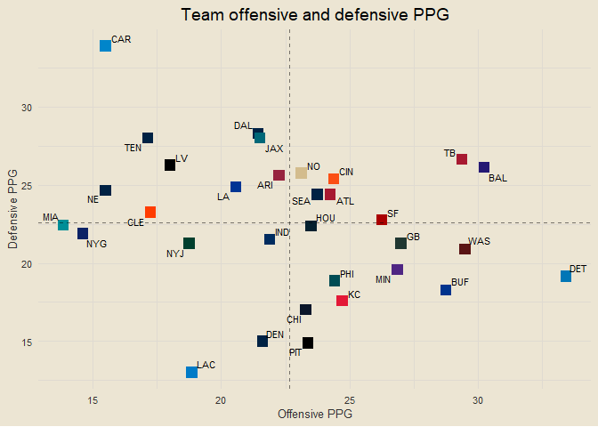
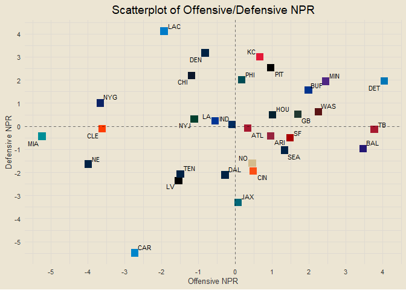

### Contents

- [Offensive and Defensive PPG](#offensive-and-defensive-ppg)
- [Offensive and Defensive YPG](#offensive-and-defensive-ypg)
- [Offensive and Defensive EPA](#offensive-and-defensive-epa)

------------------------------------------------------------------------

### Offensive and Defensive PPG

<!-- -->

------------------------------------------------------------------------

### Offensive and Defensive YPG

<!-- -->

------------------------------------------------------------------------

### Offensive and Defensive EPA

<!-- -->

------------------------------------------------------------------------

### Offense and Defense EPA Comparisons

    ## [1] "NYG vs. DAL: Bad Offense, Bad Defense vs. Good Offense, Bad Defense"
    ## [1] "ATL vs. NO: Bad Offense, Bad Defense vs. Good Offense, Good Defense"
    ## [1] "CAR vs. CIN: Bad Offense, Bad Defense vs. Good Offense, Bad Defense"
    ## [1] "CHI vs. LA: Bad Offense, Good Defense vs. Good Offense, Bad Defense"
    ## [1] "GB vs. MIN: Good Offense, Good Defense vs. Good Offense, Good Defense"
    ## [1] "HOU vs. JAX: Bad Offense, Bad Defense vs. Bad Offense, Bad Defense"
    ## [1] "IND vs. PIT: Bad Offense, Good Defense vs. Bad Offense, Good Defense"
    ## [1] "NYJ vs. DEN: Good Offense, Good Defense vs. Bad Offense, Good Defense"
    ## [1] "TB vs. PHI: Good Offense, Bad Defense vs. Good Offense, Bad Defense"
    ## [1] "ARI vs. WAS: Good Offense, Bad Defense vs. Good Offense, Bad Defense"
    ## [1] "SF vs. NE: Good Offense, Bad Defense vs. Bad Offense, Bad Defense"
    ## [1] "LAC vs. KC: Bad Offense, Good Defense vs. Good Offense, Bad Defense"
    ## [1] "LV vs. CLE: Bad Offense, Bad Defense vs. Bad Offense, Good Defense"
    ## [1] "BAL vs. BUF: Good Offense, Bad Defense vs. Good Offense, Good Defense"
    ## [1] "MIA vs. TEN: Bad Offense, Good Defense vs. Bad Offense, Good Defense"
    ## [1] "DET vs. SEA: Bad Offense, Good Defense vs. Bad Offense, Good Defense"

------------------------------------------------------------------------

### DVOA

<!-- -->

------------------------------------------------------------------------

------------------------------------------------------------------------

### NPR Standings

<!-- -->

------------------------------------------------------------------------

### Scatterplot of NPR

<!-- -->

------------------------------------------------------------------------

### Week Predictions

    ## [1] "DAL def. NYG"
    ## [1] "NO def. ATL"
    ## [1] "CIN def. CAR"
    ## [1] "CHI def. LA"
    ## [1] "MIN def. GB"
    ## [1] "HOU def. JAX"
    ## [1] "PIT def. IND"
    ## [1] "DEN def. NYJ"
    ## [1] "PHI def. TB"
    ## [1] "ARI def. WAS"
    ## [1] "SF def. NE"
    ## [1] "LAC def. KC"
    ## [1] "LV def. CLE"
    ## [1] "BUF def. BAL"
    ## [1] "TEN def. MIA"
    ## [1] "SEA def. DET"
